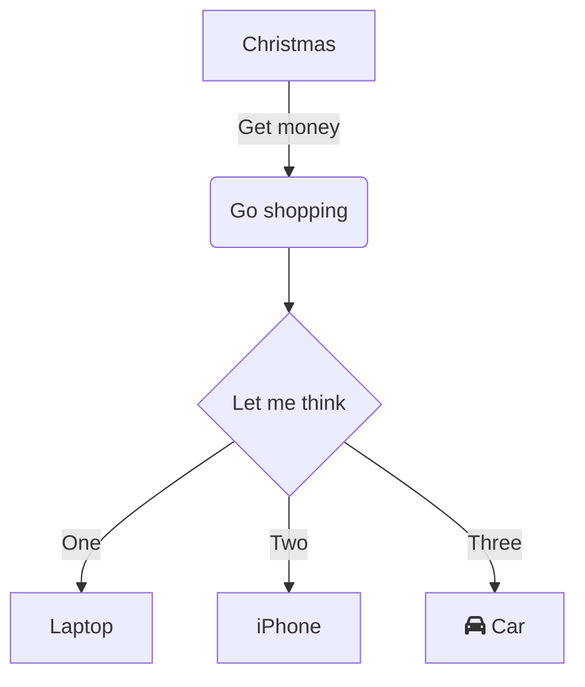

<!-- NOTE-swimm-snippet: the lines below link your snippet to Swimm -->
### 📄 Python/list_comprehensions.py
```python
13     cities = [{'name':'Beijing', 'location': (39.923674,116.335601)}, 
14     {'name':'New York', 'location': (40.690772, -73.944034)}, 
15     {'name': 'san_francisco', 'location': (37.756857, -122.434857)}]
16     
17     def print_distance_between_cities(cities):
18         for city in cities:
19             print(city['name'])
20             print(distance.distance(tel_aviv['location'], city['location']).km)
```

<br/>

<!--MERMAID {width:100}-->

<!--MCONTENT {content: "graph TD<br/>\nA\\[Christmas\\] \\-\\-\\>|Get money| B(Go shopping)<br/>\nB \\-\\-\\> C{Let me think}<br/>\nC \\-\\-\\>|One| D\\[Laptop\\]<br/>\nC \\-\\-\\>|Two| E\\[iPhone\\]<br/>\nC \\-\\-\\>|Three| F\\[fa:fa-car Car\\]<br/>\n\n<br/>"} --->

<br/>

This file was generated by Swimm. [Click here to view it in the app](https://app.swimm.io/repos/Z2l0aHViJTNBJTNBYmxvZy1leGFtcGxlcyUzQSUzQWplZmYtdmluY2VudA==/docs/dvseawt0).
